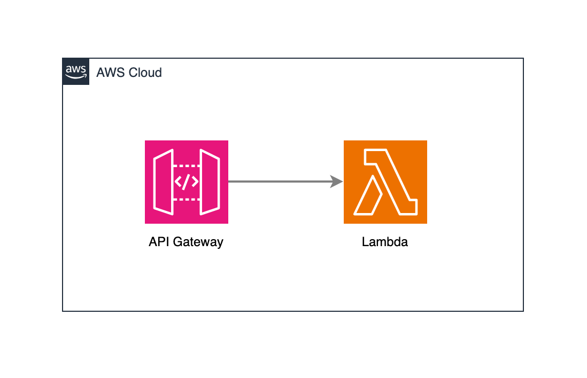

# Lambda Template

## Description

This template is a simple Lambda function that returns a random number between 1 and 10.

## Stack

- Terraform
- AWS Lambda
- AWS API Gateway
- GitHub Actions

## Diagram



## Prerequisites

- Create AWS S3 bucket for Terraform state

```bash
aws s3api create-bucket --bucket your-bucket-name-tfstate --region your-aws-region
```

- Update backend "s3" in `terraform/provider.tf`

```bash
backend "s3" {
    bucket = "your-bucket-name-tfstate"
    key    = "state.tfstate"
    region = "your-aws-region"
}
```

- Add environment variables to GitHub Actions secrets

```bash
AWS_ACCESS_KEY_ID
AWS_SECRET_ACCESS_KEY
AWS_REGION
```
