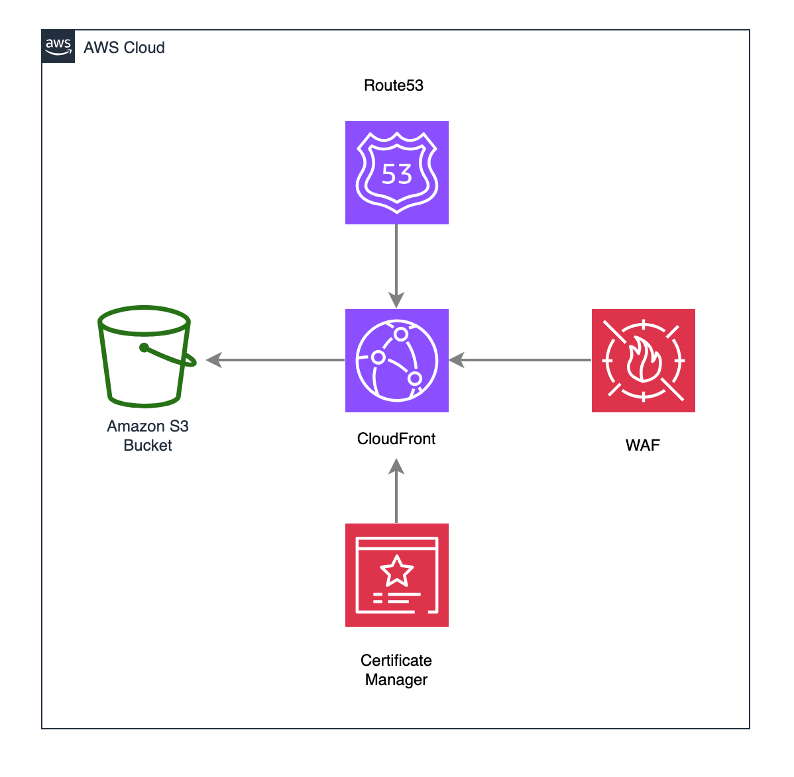

# Static Website Template

## Description

This template sets up infrastructure for hosting a static website on AWS, utilizing S3 for storage and CloudFront for content delivery.

## Stack

- Terraform
- AWS S3
- AWS CloudFront
- AWS Route53
- AWS WAF
- GitHub Actions

## Diagram



## Prerequisites

- Create AWS S3 bucket for Terraform state

```bash
aws s3api create-bucket --bucket your-bucket-name-tfstate --region your-aws-region
```

- Update backend "s3" in `terraform/provider.tf`

```bash
backend "s3" {
    bucket = "your-bucket-name-tfstate"
    key    = "state.tfstate"
    region = "your-aws-region"
}
```

- Domain Requirements:
  - A registered domain in Route53
  - An existing ACM certificate for the domain (and its subdomains)
  - The subdomain you want to use for this static website

- Add environment variables to GitHub Actions secrets

```bash
AWS_ACCESS_KEY_ID
AWS_SECRET_ACCESS_KEY
AWS_REGION
DOMAIN_NAME (your subdomain, e.g., static.example.com)
```
