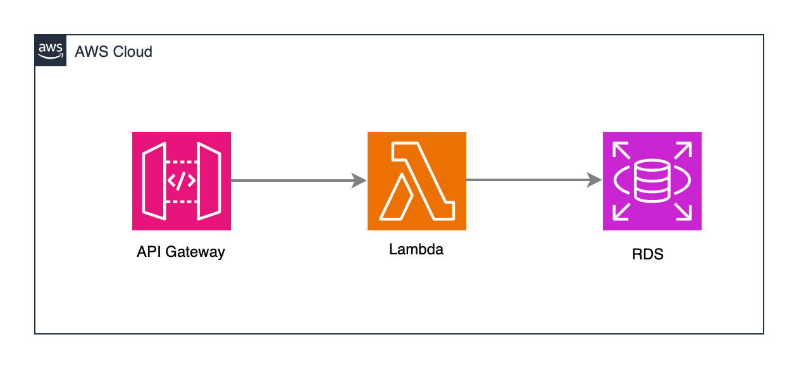

# Webhook Template

## Description

This template provides a serverless webhook endpoint implementation using AWS Lambda and API Gateway, connected to a PostgreSQL RDS database. It's designed to handle incoming webhook requests, process them through a Lambda function, and store the data in a PostgreSQL database.

The infrastructure is defined using Terraform for Infrastructure as Code (IaC) and includes CI/CD pipelines with GitHub Actions for automated deployments. This setup ensures scalability, reliability, and easy maintenance of your webhook service.

Key features:
- Serverless webhook endpoint with AWS Lambda and API Gateway
- PostgreSQL RDS database for data persistence
- Infrastructure as Code using Terraform
- Automated deployments with GitHub Actions
- CloudWatch logging and monitoring

## Stack

- Terraform
- AWS Lambda
- AWS API Gateway
- RDS PostgreSQL
- GitHub Actions

## Diagram



## Prerequisites

- Create AWS S3 bucket for Terraform state

```bash
aws s3api create-bucket --bucket your-bucket-name-tfstate --region your-aws-region
```

- Update backend "s3" in `terraform/provider.tf`

```bash
backend "s3" {
    bucket = "your-bucket-name-tfstate"
    key    = "state.tfstate"
    region = "your-aws-region"
}
```

- Add environment variables to GitHub Actions secrets

```bash
AWS_ACCESS_KEY_ID
AWS_SECRET_ACCESS_KEY
AWS_REGION
```
